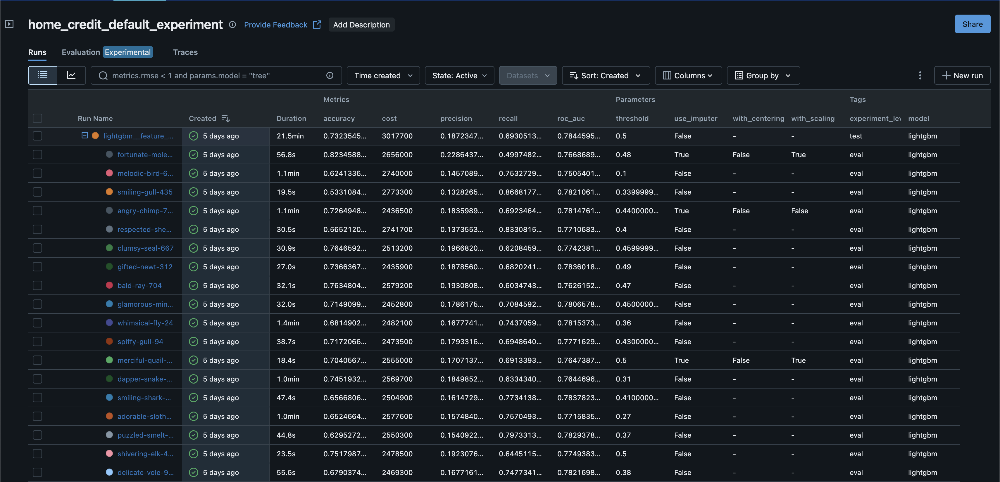

# P7 - Implement a Scoring Model

## Table of Contents
- [Overview](#overview)
- [Installation](#installation)
- [Configuration](#configuration)
- [MLflow & Model Registry](#mlflow--model-registry)
- [Hyperparameter Tuning with Optuna](#hyperparameter-tuning-with-optuna)
- [API Usage (FastAPI)](#api-usage-fastapi)
- [Running Tests](#running-tests)
- [License](#license)

## Overview

This project demonstrates the full lifecycle of a credit scoring model:
- **Data Preprocessing** and model training using scikit-learn and several models (LogisticRegression, RandomForestClassifier, LGBMClassifier and XGBClassifier).
- **Experiment tracking** with MLflow, including logging parameters, metrics, and registering the trained model in the MLflow Model Registry.
- **Hyperparameter optimization** using Optuna, with automatic logging of each trial.
- **Serving** the registered model via a FastAPI REST API for inference, including probability thresholds for decision making.
- **Automated testing** of the API endpoints using pytest.


## Installation

### Clone the repository:
  ```bash
    mkdir foo
    git clone https://github.com/jjbochard/ocr_data_science_p7 foo
    cd foo
  ```

### Create and activate a virtual environment:
First, install [Python 3.13+](https://www.python.org/downloads/).
  ```bash
    python3 -m venv venv
    source venv/bin/activate    # macOS/Linux
    .\venv\Scripts\activate   # Windows PowerShell
  ```

Install dependencies:
  ```bash
    pip3 install -r requirements.txt
  ```

 Install the JupyterLab extension (or Jupyter):
  ```bash
    pip install jupyterlab
  ```

To deactivate your venv:
  ```bash
    deactivate
  ```

### Optionnal : configure your git repository with pre-commit (if you want to fork this project)

You can install pre-commit with python

    pip install pre-commit

You can install the configured pre commit hook with

    pre-commit install

## Configuration

Copy `.env.example` to `.env` and edit as needed:

This configures MLflow to point at your tracking server and selects which model version to load.

## MLflow & Model Registry

- **Training runs** are tracked with MLflow. All parameters, metrics, and artifacts are logged.
- After training, the  best model is registered under the name `home_credit/<num_version>` in the **Model Registry**.
- The FastAPI app loads the live model from the registry (using `models:/` URI) and reads the saved `threshold` parameter.
- You can view runs and model versions in the MLflow UI:
  ```bash
  mlflow ui --host 0.0.0.0 --port 5000
  ```

## Hyperparameter Tuning with Optuna

- The Optuna script performs cross-validated searches over parameters (e.g. `threshold`, model hyperparams).
- Each trial is logged as a nested MLflow run, capturing trial parameters and evaluation metrics (cost, ROC AUC and more).
- The best parameters and optimal threshold are automatically registered in MLflow.


## API Usage (FastAPI)

- The API serves predictions via POST `/predict`.
- Payload format: MLflow `dataframe_split` JSON with `columns` and `data`.
- Response includes:
  ```json
  {
    "threshold": 0.42,
    "predictions": [0, 1],
    "predict_proba": [[0.8, 0.2], [0.3, 0.7]]
  }
  ```
- Run the API locally:
  ```bash
  make run_api_dev
  ```
- Example curl request:
  ```bash
  curl -X POST http://localhost:8000/predict \
       -H "Content-Type: application/json" \
       --data-binary @payload.json
  ```

## Running Tests

Automated tests ensure the API returns expected outputs and handles errors:
```bash
pytest tests/test_api.py
```
Tests include:
- Successful inference with a dummy model.
- 503 when model or threshold is missing.
- 422 for invalid payload schemas.
